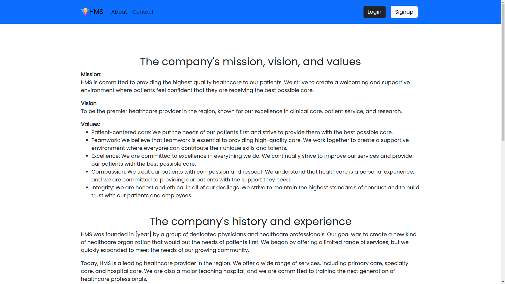
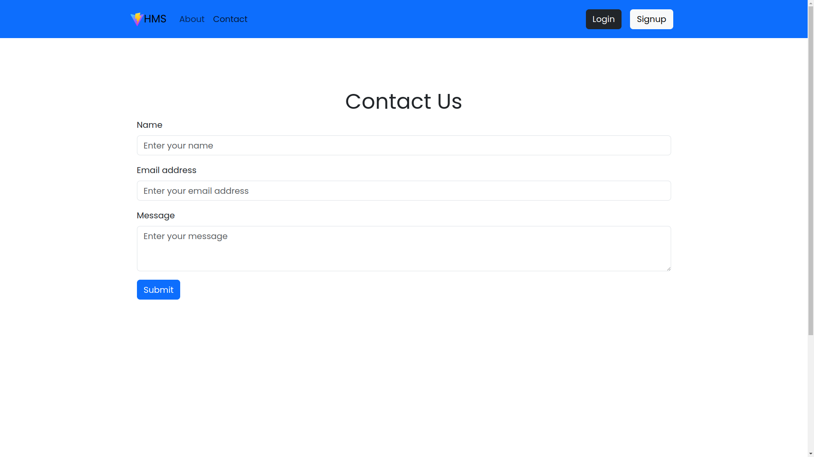
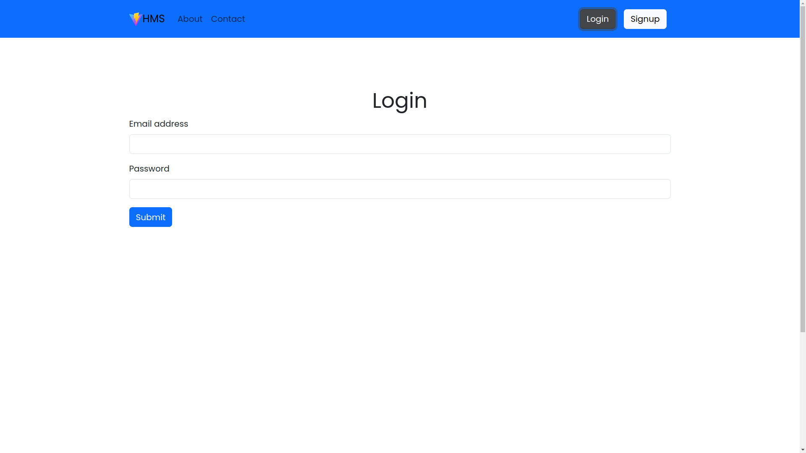
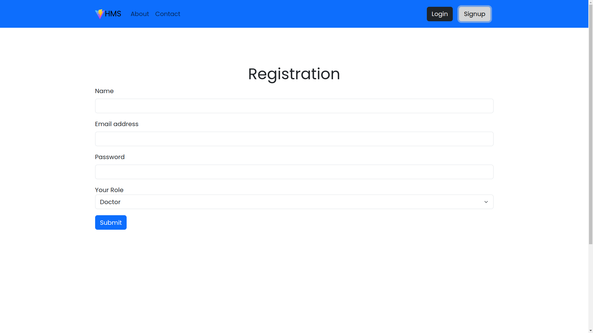
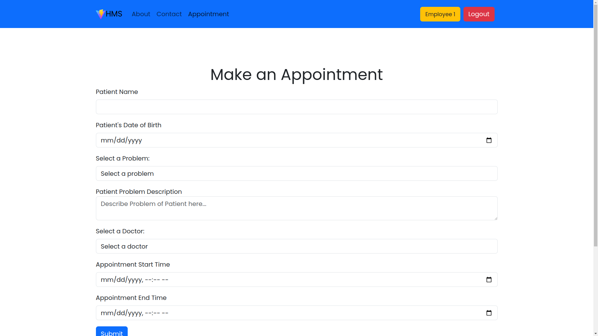
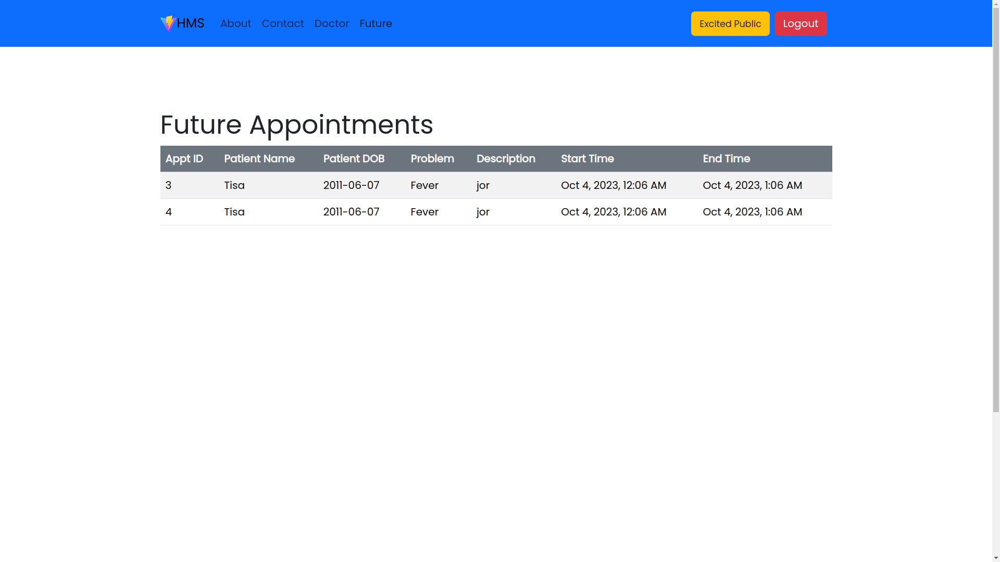
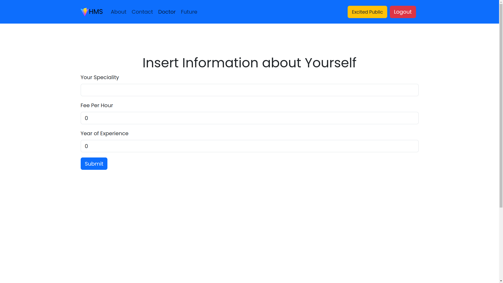

# Hospital Management System

## Description

This web application is a Hospital Management System (HMS) that allows hospital employees to make appointments with doctors on behalf of patients. Doctors can also use the system to view their future appointments.

## Installation

### Requirements

- Any Operating System (ie. MacOS X, Linux, Windows)
- A code editor or terminal
- Node.js
- MySQL (Running on the system)

### Instructions

To install this application, fork and clone this repository. Install dependencies for both client and backend. Now open Terminal and run the following commands:

**Frontend**:

```bash
cd client && npm install
```

**Backend**:

```bash
cd server && npm install
```

To start the application, run the following commands in Terminal:

**Frontend**:

```bash
cd client && vite
```

**Backend**:

```bash
cd server && npm start
```

## Features:

### Employee:

- Reigster
- Login
- Make appointments for patients

### Doctor:

- View future appointments
- Update own profile

## Technologies:

- Frontend: React.js
- Backend: Express.js
- Database: MySQL

## Usage:

- To make an appointment, log in as an employee and click on the "Make Appointment" button.
- Enter the patient's information and select the doctor and appointment time.
- Click on the "Submit" button to create the appointment.
- To view your future appointments, log in as a doctor and click on the "Future Appointments" button.
- You can view all of your upcoming appointments, as well as mark them as completed.

## Pages:

- Home Page


- About Page



- Contact Page



- Login Page



- Register Page



- Make Appointment Page (Employee)



- Future Appointments Page (Doctor)



- Update Profile Page (Doctor)



